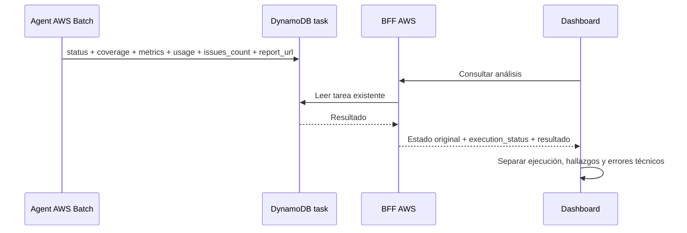

# Ejecución y resultados del análisis

El Agent conserva `status` como evaluación de seguridad y agrega `coverage`,
`metrics`, `usage` e `issues_count` al resultado en la tabla existente de tareas.
El BFF deriva `execution_status` para detalle, historial y último análisis:
`COMPLETED` si la cobertura es completa, `INCOMPLETE` si es parcial y `FAILED`
si no se completó ningún lote y existe un error explícito. Los históricos sin
cobertura conservan su estado original; no se inventa ejecución ni consumo.

El campo es aditivo y no cambia autenticación, permisos, claves, tablas ni
endpoints. Se despliega usando el mecanismo AWS actual. Integrar primero
`titvo-agent-aws/feat/cli-fullscan-aws` y esta rama, luego
`titvo-admin-web/feat/scan-dashboard`. Un frontend anterior ignora el campo.
El frontend nuevo admite respuestas anteriores sin `execution_status`.

Los hallazgos completos siguen en el reporte HTML publicado por el Agent.
`issues_count` permite mostrar su cantidad aunque el resultado DynamoDB no
incluya `issues`; `report_url` permite abrir el reporte existente. No se
realiza una copia del código analizado en el BFF.

Validación: pruebas unitarias, integración del mapeo DynamoDB a HTTP y build.
El despliegue AWS se realiza después de revisar e integrar las ramas; no se
ha ejecutado como parte de esta preparación.
